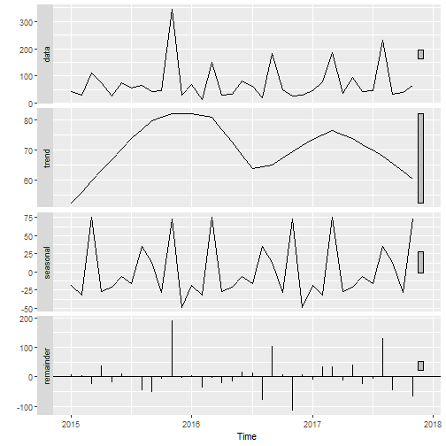
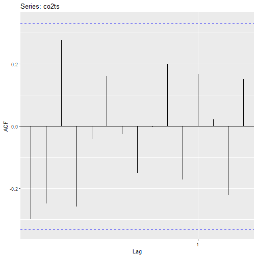

A continuación se presenta la documentación del proyecto de análisis predictivo a la empresa Lancasco. El objetivo del presente es poder predecir las ventas para el año 2018, útilizando el algoritmo más apropiado para lo mismo. 

### 0: Librerias Requeridas

  
  ```r
  library(readxl)
  library(dplyr)
  library(tidyr)
  library(cluster) 
  library(e1071)
  library(mclust) 
  library(fpc) 
  library(NbClust) 
  library(factoextra) 
  library(ggplot2)
  library(rpart)
  library(caret)
  library(rpart.plot)
  library(randomForest)
  library(e1071)
  library(caret)
  library(fastDummies)
  library(rpart)
  library(rpart.plot)
  library(ggfortify)
  library(corrplot)
  library(forecast)
  library(tseries)
  library(stringr)
  ```

### 1: Lectura de Información

Para esta sección se utiliza la librería "readxl".


```r
historia <- read_excel("Catálogo Guatemala 2018-2019.xlsx", sheet = 1,col_names=TRUE)
```

```
## New names:
## * Pagina -> Pagina...7
## * Pagina -> Pagina...22
## * `%` -> `%...24`
## * `%` -> `%...26`
```

```r
Paginacion20152019 <- read_excel("Paginacion 2015-2019.xlsx", sheet = 1)
UnidadesPorSector <- read_excel("UnidadesPorSectorNew.xlsx", sheet = 1)
```

### 2: Limpieza y Preparación de Datos. 

**Nota:** Es importante notar que se corrigio a mano el archivo de excel llamado:"Unidades por Sector". Ver más en la guia de implementación.

Debido a que muchas veces la información solicitada no se encuentra de la forma ideal, se debe realizar un proceso de limpieza de datos donde se elimine y se corrija información de la data, estos pasos son los siguientes:

1. Renombramiento de columnas:

Al cargar la data, muchas veces R carga el nombre de columnas como algo totalmente diferente. Esto es por muchas razones, pero en este caso es porque las columnas tienen nombre no válidos para el lenguaje. En este paso, se buscan las columnas cuyos nombres fueron cambiados y se le colocan los nombres nuevos


```r
colnames(historia)
```

```
##  [1] "Año Mes"             "Producto"            "CONCA"              
##  [4] "Codigo Catalogo"     "Descripcion"         "Categoria"          
##  [7] "Pagina...7"          "Linea"               "Precio Catalogo"    
## [10] "Precio Vta s/iva"    "Pronostico"          "Unidades Vendidas"  
## [13] "Venta Neta s/iva"    "Costo"               "Utilidad"           
## [16] "Margen"              "Pedido Real"         "Ratio"              
## [19] "Observaciones"       "Canal de Venta"      "Contingencia"       
## [22] "Pagina...22"         "Tipo Precio"         "%...24"             
## [25] "Tipo Comision"       "%...26"              "Atributo Neto"      
## [28] "Energy Chart"        "Promociones"         "Recursos Especiales"
## [31] "Treboles extra"
```

```r
names(historia)[names(historia) == "Pagina...7"] <- "Pagina"
names(historia)[names(historia) == "Pagina...22"] <- "Tipo.pagina"
names(historia)[names(historia) == "%..24"] <- "Porcentaje precio"
names(historia)[names(historia) == "%..26"] <- "Porcentaje comision"
names(historia)[names(historia) == "Tipo Precio"] <- "Tipo.Precio"
names(historia)[names(historia) == "Energy Chart"] <- "Energy Chart"
```

2. Estandarización a Mayúsculas

Esto se realiza para poder manejar correctamente la información, ya que facilita a la hora de manejar la información.


```r
historia <- data.frame(lapply(historia, function(v) {
  if (is.character(v)) return(toupper(v))
  else return(v)
}))

head(historia)
```

```
##   Año.Mes   Producto            CONCA Codigo.Catalogo
## 1  201801 4123660610 2018014123660610            1097
## 2  201801 4123660595 2018014123660595            1048
## 3  201801 4123660599 2018014123660599            1052
## 4  201801 4123660616 2018014123660616            1165
## 5  201801 4123761204 2018014123761204           11478
## 6  201801 4117270738 2018014117270738              73
##                               Descripcion              Categoria Pagina
## 1               DUO BETES CORPORAL Y PIES             USO DIARIO      1
## 2    TOP FAMILY CREMA BETES CORPORAL 370G      SALUD Y BIENESTAR      1
## 3         TOP FAMILY CREMA BETES PIES 90G      SALUD Y BIENESTAR      1
## 4                  TORINO FENOGRECO 100GR                  ELLAS     53
## 5 PAQUETE RECOMENDADO  GUATEMALA ENERO 18               PAQUETES      1
## 6                       MOCHILA PARA NIÑA PROMOCIONALES VENDIDOS     81
##              Linea Precio.Catalogo Precio.Vta.s.iva Pronostico
## 1           FAMILY           42.95         26.84375          0
## 2           FAMILY           35.00         21.87500       1650
## 3           FAMILY           32.00         20.00000       1700
## 4           FAMILY           11.95          7.46875       1000
## 5 PAQUETES SCENTIA          735.65        459.78125          0
## 6          PREMIOS           29.95         18.71875       1750
##   Unidades.Vendidas Venta.Neta.s.iva Costo Utilidad    Margen Pedido.Real
## 1               385         10073.95  NULL 10073.95 1.0000000           0
## 2                49          1074.09   6.7   745.79 0.6943459       11360
## 3                25           502.29  3.48   415.29 0.8267933       11360
## 4               341          2529.59  3.04  1492.95 0.5901945       11360
## 5               181         77275.69  NULL 77275.69 1.0000000           0
## 6               824         15354.60  7.14  9471.24 0.6168340       11360
##         Ratio                              Observaciones Canal.de.Venta
## 1 0.000000000                       5893 PROMOCION COMBO   CONTINGENCIA
## 2 0.004313380                       5893 PROMOCION COMBO   CONTINGENCIA
## 3 0.002200704                       5893 PROMOCION COMBO   CONTINGENCIA
## 4 0.030017606                                          0       CATALOGO
## 5 0.000000000 5888 PROMOCION COMBO,5889 PROMOCION PRECIO SCENTIA AL DIA
## 6 0.072535211                       5888 PROMOCION COMBO       CATALOGO
##   Contingencia      Tipo.pagina   Tipo.Precio X....24 Tipo.Comision
## 1        FARMA      FULL SPREAD  SUPER OFERTA      80        NORMAL
## 2        FARMA      FULL SPREAD PRECIO NORMAL     100        NORMAL
## 3        FARMA      FULL SPREAD PRECIO NORMAL     100        NORMAL
## 4         <NA> PAGINA IZQUIERDA PRECIO OFERTA      90        NORMAL
## 5         <NA>      FULL SPREAD  SUPER OFERTA      80          NETO
## 6         <NA>   PAGINA DERECHA  SUPER OFERTA      80        NORMAL
##   X....26 Atributo.Neto Energy.Chart             Promociones
## 1      50     NO APLICA         <NA>                     DUO
## 2      50     NO APLICA         <NA>                    <NA>
## 3      50     NO APLICA         <NA>                    <NA>
## 4      25     NO APLICA         <NA>        PROMOCION PRECIO
## 5       3     NO APLICA         <NA> PORCENTAJE DE DESCUENTO
## 6      33     NO APLICA         <NA>        PROMOCION PRECIO
##   Recursos.Especiales Treboles.extra
## 1                <NA>           <NA>
## 2                <NA>           <NA>
## 3                <NA>           <NA>
## 4                <NA>           <NA>
## 5                <NA>             SI
## 6                <NA>           <NA>
```


```r
clean_historia <- historia[1:31]
clean_historia <- data.frame(lapply(clean_historia, function(v) {
  if (is.character(v)) return(toupper(v))
  else return(v)
}))

ggplot(data = clean_historia)+
  xlab("Cantidad por tipo de pagina")+
  ggtitle("Tipo de pagina")+
  geom_bar(mapping = aes(x =Tipo.pagina))+ theme(axis.text.x = element_text(angle = 45, hjust = 1))
```


3. Eliminación y Correción de Caracteres Especiales

Esto se realiza porque pueden afectar en el momento de trabajar con la data, es posible que el lenguaje tenga problemas para leer o comprender correctamente ciertos carácteres especiales. 

Primero separamos las colúmnas con carácteres especiales


```r
historia = separate(data =  historia, 
                              col  =  Año.Mes,  
                              into =  c("A?o", "Mes"), 
                              sep  =  4, remove = TRUE,
                              convert = TRUE )

Paginacion20152019 = separate(data =  Paginacion20152019, 
                              col  =  `Año Mes`,  
                              into =  c("A?o", "Mes"), 
                              sep  =  4, remove = TRUE,
                              convert = TRUE )
# separar producto y descripcion 
UnidadesPorSector = separate(data =  UnidadesPorSector, 
                              col  =  `Producto - Descripcion`,  
                              into =  c("Producto", "Descripcion"), 
                              sep  =  10, remove = TRUE,
                              convert = TRUE )
```

Luego, continuamos quitando las tildes y espacios innecesarios dentro de la información.


```r
# quitar tildes
historia$Descripcion <- chartr('??????','AEIOUN', historia$Descripcion)

Paginacion20152019$Descripcion <- chartr('??????','AEIOUN', Paginacion20152019$Descripcion)

Paginacion20152019 <- Paginacion20152019[complete.cases(Paginacion20152019$Pagina),]

#Quitar espacios al inicio y fin
Paginacion20152019$Pagina = gsub("^ ", "", Paginacion20152019$Pagina)
Paginacion20152019$Pagina = gsub(" $", "", Paginacion20152019$Pagina)
```

Por último, quitamos valores Nulos ya que son información poco relevante para el análisis. 


```r
historia$Precio.Catalogo <- sub("NULL", NA, historia$Precio.Catalogo)
historia <- historia[complete.cases(historia$Precio.Catalogo),]

historia$Precio.Vta.s.iva <- sub("NULL", NA, historia$Precio.Vta.s.iva)
historia <- historia[complete.cases(historia$Precio.Vta.s.iva),]

historia$Costo <- sub("NULL", NA, historia$Costo)
historia <- historia[complete.cases(historia$Costo),]

head(sort(table(historia$Unidades.Vendidas) , decreasing = TRUE), n = 10)
```

```
## 
##    0   48   76  109  167   49  159  166   53   92 
## 1060   16   16   16   16   15   15   15   14   14
```

```r
Paginacion20152019$`Precio Catalogo` <- sub("NULL", NA, Paginacion20152019$`Precio Catalogo`)
Paginacion20152019 <- Paginacion20152019[complete.cases(Paginacion20152019$`Precio Catalogo`),]

Paginacion20152019$`Precio Vta s/iva` <- sub("NULL", NA, Paginacion20152019$`Precio Vta s/iva`)
Paginacion20152019 <- Paginacion20152019[complete.cases(Paginacion20152019$`Precio Vta s/iva`),]

Paginacion20152019$Costo <- sub("NULL", NA, Paginacion20152019$Costo)
Paginacion20152019 <- Paginacion20152019[complete.cases(Paginacion20152019$Costo),]
clean_historia[is.na(clean_historia$`Precio Catalogo`),] <- 0

clean_historia[is.na(clean_historia$`Precio Vta s/iva`),] <- 0
```

### 3: Análisis Exploratorio

Se realiza un análisis exploratorio que permite entender de mejor la información. Ayuda a entender la distribución de la información, y encontrar puntos de interes útiles para el análisis. A continuación, se mostrarán los pasos tomados pero no se explicarán a profundidad el resultado, para esto leer el reporte final del proyecto. 

Primero, se realiza gráficas de barras para ver las unidades vendidas por sector. 


A continuación se calcula por tipo de categoriá, para observar que categoriá genera las mayores ventas. Esto ayudará a entender que categorias tomar encuenta en el algoritmo. 


```r
ggplot(data = UnidadesPorSector)+
  xlab("Cantidad por categoria")+
  geom_bar(mapping = aes(x =DescripcionCategoria))+ 
  theme(axis.text.x = element_text(angle = 45, hjust = 1))
```


Seguimos con realizar un visualización de unidades por el sector de venta.


```r
ggplot(data = UnidadesPorSector)+
  xlab("Cantidad por sector")+
  geom_bar(mapping = aes(x =Sector))+ theme(axis.text.x = element_text(angle = 45, hjust = 1))
```


```r
  ggplot(data = clean_historia[!is.na(clean_historia$Tipo.pagina),])+
    xlab("Cantidad por pagina")+
    ggtitle("Tipo Pagina")+
    geom_bar(mapping = aes(x = Tipo.pagina))+ theme(axis.text.x = element_text(angle = 45, hjust = 1))
```


```r
ggplot(data = clean_historia[clean_historia$Tipo.Precio!="PRECIO NUNCA ANTES VISTO",])+
    xlab("Cantidad por tipo precio")+
    ggtitle("Tipo de Precio")+
    geom_bar(mapping = aes(x = Tipo.Precio))+ theme(axis.text.x = element_text(angle = 45, hjust = 1))
```


```r
ggplot(data = clean_historia)+
    xlab("Cantidad por Energy chart")+
    ggtitle("Energy chart")+
    geom_bar(mapping = aes(x = Energy.Chart))+ theme(axis.text.x = element_text(angle = 45, hjust = 1))
```


```r
  ggplot(data = clean_historia)+
    xlab("Cantidad por Promociones")+
    ggtitle("Promociones")+
    geom_bar(mapping = aes(x = Promociones))+ theme(axis.text.x = element_text(angle = 45, hjust = 1))
```


```r
checkformin_precio <- clean_historia[clean_historia$Precio.Catalogo !=0,] 
names(checkformin_precio)
```

```
##  [1] "Año.Mes"             "Producto"            "CONCA"              
##  [4] "Codigo.Catalogo"     "Descripcion"         "Categoria"          
##  [7] "Pagina"              "Linea"               "Precio.Catalogo"    
## [10] "Precio.Vta.s.iva"    "Pronostico"          "Unidades.Vendidas"  
## [13] "Venta.Neta.s.iva"    "Costo"               "Utilidad"           
## [16] "Margen"              "Pedido.Real"         "Ratio"              
## [19] "Observaciones"       "Canal.de.Venta"      "Contingencia"       
## [22] "Tipo.pagina"         "Tipo.Precio"         "X....24"            
## [25] "Tipo.Comision"       "X....26"             "Atributo.Neto"      
## [28] "Energy.Chart"        "Promociones"         "Recursos.Especiales"
## [31] "Treboles.extra"
```

```r
qqnorm(checkformin_precio$Precio.Catalogo, main = "Precio catalogo", col = 2)
```


```r
checkformin_venta_sin_iva <- clean_historia[clean_historia$`Precio Vta s/iva` !=0,] 
names(checkformin_venta_sin_iva)
```

```
##  [1] "Año.Mes"             "Producto"            "CONCA"              
##  [4] "Codigo.Catalogo"     "Descripcion"         "Categoria"          
##  [7] "Pagina"              "Linea"               "Precio.Catalogo"    
## [10] "Precio.Vta.s.iva"    "Pronostico"          "Unidades.Vendidas"  
## [13] "Venta.Neta.s.iva"    "Costo"               "Utilidad"           
## [16] "Margen"              "Pedido.Real"         "Ratio"              
## [19] "Observaciones"       "Canal.de.Venta"      "Contingencia"       
## [22] "Tipo.pagina"         "Tipo.Precio"         "X....24"            
## [25] "Tipo.Comision"       "X....26"             "Atributo.Neto"      
## [28] "Energy.Chart"        "Promociones"         "Recursos.Especiales"
## [31] "Treboles.extra"
```

```r
qqnorm(checkformin_precio$Precio.Vta.s.iva, main = "Precio venta sin iva", col = 2)
```


```r
qqnorm(clean_historia$Pronostico, main = "Pronostico", col = 2)
```


```r
summary(clean_historia$Unidades.Vendidas)
```

```
##    Min. 1st Qu.  Median    Mean 3rd Qu.    Max. 
##   -84.0     0.0   209.0   675.2   640.0 51957.0
```

```r
qqnorm(clean_historia$Unidades.Vendidas, main = "Unidades vendidas", col = 2)
```


```r
checkformin_ventaneta_sin_iva <- clean_historia[clean_historia$Venta.Neta.s.iva !=0,] 
summary(checkformin_venta_sin_iva)
```

```
##     Año.Mes       Producto                CONCA   Codigo.Catalogo
##  Min.   : NA   Min.   : NA   201801          :0   Min.   : NA    
##  1st Qu.: NA   1st Qu.: NA   2018014117080142:0   1st Qu.: NA    
##  Median : NA   Median : NA   2018014117080226:0   Median : NA    
##  Mean   :NaN   Mean   :NaN   2018014117263475:0   Mean   :NaN    
##  3rd Qu.: NA   3rd Qu.: NA   2018014117270738:0   3rd Qu.: NA    
##  Max.   : NA   Max.   : NA   2018014117270739:0   Max.   : NA    
##                              (Other)         :0                  
##                                                           Descripcion
##  10 PCS PIZZA PLAY SET ON CARD                                  :0   
##  10X7.5  BASKET BALL BOARD PLAY SET IN NET BAG                  :0   
##  12 ESTUCHES 35% DE DESCUENTO 3 FRAGANCIAS GRATIS DICIEMBRE     :0   
##  25 ESTUCHES 35% DE DESCUENTO 6 FRAGANCIAS GRATIS 1/2 TREBOL  DC:0   
##  2STRONG ROLL ON VANILLA TWIST 80G                              :0   
##  3 PACK BURBUJAS                                                :0   
##  (Other)                                                        :0   
##                Categoria     Pagina            Linea   Precio.Catalogo
##  CABELLO            :0   Min.   : NA   ACCESORIOS :0   Min.   : NA    
##  CUIDADO DE LA PIEL :0   1st Qu.: NA   ACNE FREE  :0   1st Qu.: NA    
##  CUIDADO DE LAS UÑAS:0   Median : NA   APOLO      :0   Median : NA    
##  CUIDADO PERSONAL   :0   Mean   :NaN   BABY POWDER:0   Mean   :NaN    
##  DIVISION FARMA     :0   3rd Qu.: NA   BASIC CARE :0   3rd Qu.: NA    
##  ELLAS              :0   Max.   : NA   BELLA COLOR:0   Max.   : NA    
##  (Other)            :0                 (Other)    :0                  
##  Precio.Vta.s.iva   Pronostico  Unidades.Vendidas Venta.Neta.s.iva
##  Min.   : NA      Min.   : NA   Min.   : NA       Min.   : NA     
##  1st Qu.: NA      1st Qu.: NA   1st Qu.: NA       1st Qu.: NA     
##  Median : NA      Median : NA   Median : NA       Median : NA     
##  Mean   :NaN      Mean   :NaN   Mean   :NaN       Mean   :NaN     
##  3rd Qu.: NA      3rd Qu.: NA   3rd Qu.: NA       3rd Qu.: NA     
##  Max.   : NA      Max.   : NA   Max.   : NA       Max.   : NA     
##                                                                   
##      Costo      Utilidad       Margen     Pedido.Real      Ratio    
##  0      :0   Min.   : NA   Min.   : NA   Min.   : NA   Min.   : NA  
##  0.02   :0   1st Qu.: NA   1st Qu.: NA   1st Qu.: NA   1st Qu.: NA  
##  0.3    :0   Median : NA   Median : NA   Median : NA   Median : NA  
##  0.36   :0   Mean   :NaN   Mean   :NaN   Mean   :NaN   Mean   :NaN  
##  0.39   :0   3rd Qu.: NA   3rd Qu.: NA   3rd Qu.: NA   3rd Qu.: NA  
##  0.4    :0   Max.   : NA   Max.   : NA   Max.   : NA   Max.   : NA  
##  (Other):0                                                          
##                  Observaciones        Canal.de.Venta Contingencia
##  0                      :0     CATALOGO      :0      FARMA:0     
##  5843 PROMOCION COMBINAR:0     CONTINGENCIA  :0                  
##  5844 PROMOCION COMBO   :0     SCENTIA AL DIA:0                  
##  5845 PROMOCION COMBO   :0                                       
##  5846 PROMOCION COMBO   :0                                       
##  5847 PROMOCION COMBO   :0                                       
##  (Other)                :0                                       
##            Tipo.pagina                   Tipo.Precio    X....24   
##  FULL SPREAD     :0    INTRODUCCION            :0    Min.   : NA  
##  PAGINA DERECHA  :0    PRECIO MAS BAJO DEL AÑO :0    1st Qu.: NA  
##  PAGINA IZQUIERDA:0    PRECIO NORMAL           :0    Median : NA  
##                        PRECIO NUNCA ANTES VISTO:0    Mean   :NaN  
##                        PRECIO OFERTA           :0    3rd Qu.: NA  
##                        SUPER OFERTA            :0    Max.   : NA  
##                                                                   
##  Tipo.Comision    X....26          Atributo.Neto
##  NETO  :0      Min.   : NA   AGOTAMIENTO  :0    
##  NORMAL:0      1st Qu.: NA   DEMO DE LINEA:0    
##                Median : NA   DEMO NUEVO   :0    
##                Mean   :NaN   NO APLICA    :0    
##                3rd Qu.: NA   PAQUETES     :0    
##                Max.   : NA                      
##                                                 
##                 Energy.Chart       Promociones       Recursos.Especiales
##  APERTURA             :0     1 X 2 X     :0    CONTRA PORTADA  :0       
##  CIERRE               :0     1X 3X       :0    FLAP DE ENTRADA :0       
##  OFERTA ESENCIAL      :0     1X 4X       :0    FLAP DE SALIDA  :0       
##  OFERTA ESPECIAL      :0     2 X 2 X     :0    PAGINA PERFUMADA:0       
##  OFERTA ESPECTACULAR  :0     COMBO       :0    PORTADA         :0       
##  OFERTA EXTRAORDINARIA:0     CONTINGENCIA:0    POSTER          :0       
##  (Other)              :0     (Other)     :0    (Other)         :0       
##  Treboles.extra
##  SI:0          
##                
##                
##                
##                
##                
## 
```

```r
qqnorm(checkformin_precio$Venta.Neta.s.iva, main = "venta sin iva", col = 2)
```


```r
names(clean_historia)
```

```
##  [1] "Año.Mes"             "Producto"            "CONCA"              
##  [4] "Codigo.Catalogo"     "Descripcion"         "Categoria"          
##  [7] "Pagina"              "Linea"               "Precio.Catalogo"    
## [10] "Precio.Vta.s.iva"    "Pronostico"          "Unidades.Vendidas"  
## [13] "Venta.Neta.s.iva"    "Costo"               "Utilidad"           
## [16] "Margen"              "Pedido.Real"         "Ratio"              
## [19] "Observaciones"       "Canal.de.Venta"      "Contingencia"       
## [22] "Tipo.pagina"         "Tipo.Precio"         "X....24"            
## [25] "Tipo.Comision"       "X....26"             "Atributo.Neto"      
## [28] "Energy.Chart"        "Promociones"         "Recursos.Especiales"
## [31] "Treboles.extra"
```

```r
checkformin_costo <- clean_historia$Costo %>% replace(.=="NULL", NA)
checkformin_costo[is.na(checkformin_costo)] <- 0
checkformin_costo <- checkformin_costo[checkformin_costo !=0]
checkformin_costo <- as.numeric(checkformin_costo)
summary(checkformin_costo)
```

```
##    Min. 1st Qu.  Median    Mean 3rd Qu.    Max. 
##     2.0   484.0   761.0   711.5   982.0  1264.0
```


```r
qqnorm(checkformin_costo, main = "Costo", col = 2)
```


```r
summary(clean_historia$Margen)
```

```
##    Min. 1st Qu.  Median    Mean 3rd Qu.    Max. 
## -0.9045  0.0000  0.5911  0.4833  0.6870  1.2301
```

```r
qqnorm(clean_historia$Margen ,main = "Margen", col = 2)
```


```r
summary(clean_historia$Ratio)
```

```
##      Min.   1st Qu.    Median      Mean   3rd Qu.      Max. 
## -0.006497  0.000000  0.014116  0.047452  0.045088  3.576582
```

```r
qqnorm(clean_historia$Ratio ,main = "Ratio", col = 2)
```


### 4: Cálculo de Varianza


```r
df_unidades <- read_excel("UnidadesPorSectorNew.xlsx")
clean_df <- df_unidades%>%
  na.omit()

new_df <- clean_df%>%
  group_by(`Producto - Descripcion`)%>%
  summarise(tot_151=sum(`20151`),
            tot_152=sum(`20152`),
            tot_153=sum(`20153`),
            tot_153=sum(`20153`),
            tot_154=sum(`20154`),
            tot_155=sum(`20155`),
            tot_156=sum(`20156`),
            tot_157=sum(`20157`),
            tot_158=sum(`20158`),
            tot_159=sum(`20159`),
            tot_1510=sum(`201510`),
            tot_1511=sum(`201511`),
            tot_1512=sum(`201512`),
            tot_161=sum(`20161`),
            tot_162=sum(`20162`),
            tot_163=sum(`20163`),
            tot_164=sum(`20164`),
            tot_165=sum(`20165`),
            tot_166=sum(`20166`),
            tot_167=sum(`20167`),
            tot_168=sum(`20168`),
            tot_169=sum(`20169`),
            tot_1610=sum(`201610`),
            tot_1611=sum(`201611`),
            tot_1612=sum(`201612`),
            tot_171=sum(`20171`),
            tot_172=sum(`20172`),
            tot_173=sum(`20173`),
            tot_174=sum(`20174`),
            tot_175=sum(`20175`),
            tot_176=sum(`20176`),
            tot_177=sum(`20177`),
            tot_178=sum(`20178`),
            tot_179=sum(`20179`),
            tot_1710=sum(`201710`),
            tot_1711=sum(`201711`),
            tot_1712=sum(`201712`),
            tot_181=sum(`20181`),
            tot_182=sum(`20182`),
            tot_183=sum(`20183`),
            tot_184=sum(`20184`),
            tot_185=sum(`20185`),
            tot_186=sum(`20186`),
            tot_187=sum(`20187`),
            tot_188=sum(`20188`),
            tot_189=sum(`20189`),
            tot_1810=sum(`201810`),
            tot_1811=sum(`201811`)
            )
N <- length(new_df$`Producto - Descripcion`)

var_df <- new_df%>%
  group_by(`Producto - Descripcion`)%>%
  summarise(
    med_151=tot_151/N,
    var151 = sum((tot_151 - med_151)^2, (N - n())*med_151^2)/(N - 1),
    
    med_152=tot_152/N,
    var152 = sum((tot_152 - med_151)^2, (N - n())*med_152^2)/(N - 1),
    
    med_153=tot_153/N,
    var153 = sum((tot_153 - med_153)^2, (N - n())*med_153^2)/(N - 1),
    
    med_154=tot_154/N,
    var154 = sum((tot_154 - med_154)^2, (N - n())*med_154^2)/(N - 1),
    
    med_155=tot_155/N,
    var155 = sum((tot_155 - med_155)^2, (N - n())*med_155^2)/(N - 1),
    
    med_156=tot_156/N,
    var156 = sum((tot_156 - med_156)^2, (N - n())*med_156^2)/(N - 1),
    
    med_157=tot_157/N,
    var157 = sum((tot_157 - med_157)^2, (N - n())*med_157^2)/(N - 1),
    
    med_158=tot_158/N,
    var158 = sum((tot_158 - med_158)^2, (N - n())*med_158^2)/(N - 1),
    med_159=tot_159/N,
    var159 = sum((tot_159 - med_159)^2, (N - n())*med_159^2)/(N - 1),
    
    med_1510=tot_1510/N,
    var1510 = sum((tot_1510 - med_1510)^2, (N - n())*med_1510^2)/(N - 1),
    
    med_1511=tot_1511/N,
    var1511 = sum((tot_1511 - med_1511)^2, (N - n())*med_1511^2)/(N - 1),
    
    med_1512=tot_1512/N,
    var1512 = sum((tot_1512 - med_1512)^2, (N - n())*med_1512^2)/(N - 1),
    med_161=tot_161/N,
    var161 = sum((tot_161 - med_161)^2, (N - n())*med_161^2)/(N - 1),
    
    med_162=tot_162/N,
    var162 = sum((tot_162 - med_161)^2, (N - n())*med_162^2)/(N - 1),
    
    med_163=tot_163/N,
    var163 = sum((tot_163 - med_163)^2, (N - n())*med_163^2)/(N - 1),
    
    med_164=tot_164/N,
    var164 = sum((tot_164 - med_164)^2, (N - n())*med_164^2)/(N - 1),
    
    med_165=tot_165/N,
    var165 = sum((tot_165 - med_165)^2, (N - n())*med_165^2)/(N - 1),
    
    med_166=tot_166/N,
    var166 = sum((tot_166 - med_166)^2, (N - n())*med_166^2)/(N - 1),
    
    med_167=tot_167/N,
    var167 = sum((tot_167 - med_167)^2, (N - n())*med_167^2)/(N - 1),
    
    med_168=tot_168/N,
    var168 = sum((tot_168 - med_168)^2, (N - n())*med_168^2)/(N - 1),
    med_169=tot_169/N,
    var169 = sum((tot_169 - med_169)^2, (N - n())*med_169^2)/(N - 1),
    
    med_1610=tot_1610/N,
    var1610 = sum((tot_1610 - med_1610)^2, (N - n())*med_1610^2)/(N - 1),
    
    med_1611=tot_1611/N,
    var1611 = sum((tot_1611 - med_1611)^2, (N - n())*med_1611^2)/(N - 1),
    
    med_1612=tot_1612/N,
    var1612 = sum((tot_1612 - med_1612)^2, (N - n())*med_1612^2)/(N - 1),
    med_171=tot_171/N,
    var171 = sum((tot_171 - med_171)^2, (N - n())*med_171^2)/(N - 1),
    
    med_172=tot_172/N,
    var172 = sum((tot_172 - med_171)^2, (N - n())*med_172^2)/(N - 1),
    
    med_173=tot_173/N,
    var173 = sum((tot_173 - med_173)^2, (N - n())*med_173^2)/(N - 1),
    
    med_174=tot_174/N,
    var174 = sum((tot_174 - med_174)^2, (N - n())*med_174^2)/(N - 1),
    
    med_175=tot_175/N,
    var175 = sum((tot_175 - med_175)^2, (N - n())*med_175^2)/(N - 1),
    
    med_176=tot_176/N,
    var176 = sum((tot_176 - med_176)^2, (N - n())*med_176^2)/(N - 1),
    
    med_177=tot_177/N,
    var177 = sum((tot_177 - med_177)^2, (N - n())*med_177^2)/(N - 1),
    
    med_178=tot_178/N,
    var178 = sum((tot_178 - med_178)^2, (N - n())*med_178^2)/(N - 1),
    med_179=tot_179/N,
    var179 = sum((tot_179 - med_179)^2, (N - n())*med_179^2)/(N - 1),
    
    med_1710=tot_1710/N,
    var1710 = sum((tot_1710 - med_1710)^2, (N - n())*med_1710^2)/(N - 1),
    
    med_1711=tot_1711/N,
    var1711 = sum((tot_1711 - med_1711)^2, (N - n())*med_1711^2)/(N - 1),
    
    med_1712=tot_1712/N,
    var1712 = sum((tot_1712 - med_1712)^2, (N - n())*med_1712^2)/(N - 1),
    
    med_181=tot_181/N,
    var181 = sum((tot_181 - med_181)^2, (N - n())*med_181^2)/(N - 1),
    
    med_182=tot_182/N,
    var182 = sum((tot_182 - med_181)^2, (N - n())*med_182^2)/(N - 1),
    
    med_183=tot_183/N,
    var183 = sum((tot_183 - med_183)^2, (N - n())*med_183^2)/(N - 1),
    
    med_184=tot_184/N,
    var184 = sum((tot_184 - med_184)^2, (N - n())*med_184^2)/(N - 1),
    
    med_185=tot_185/N,
    var185 = sum((tot_185 - med_185)^2, (N - n())*med_185^2)/(N - 1),
    
    med_186=tot_186/N,
    var186 = sum((tot_186 - med_186)^2, (N - n())*med_186^2)/(N - 1),
    
    med_187=tot_187/N,
    var187 = sum((tot_187 - med_187)^2, (N - n())*med_187^2)/(N - 1),
    
    med_188=tot_188/N,
    var188 = sum((tot_188 - med_188)^2, (N - n())*med_188^2)/(N - 1),
    med_189=tot_189/N,
    var189 = sum((tot_189 - med_189)^2, (N - n())*med_189^2)/(N - 1),
    
    med_1810=tot_1810/N,
    var1810 = sum((tot_1810 - med_1810)^2, (N - n())*med_1810^2)/(N - 1),
    
    med_1811=tot_1811/N,
    var1811 = sum((tot_1811 - med_1811)^2, (N - n())*med_1811^2)/(N - 1)
    )
head(var_df)
```

```
## # A tibble: 6 x 95
##   `Producto - Des~ med_151  var151 med_152 var152 med_153 var153 med_154
##   <chr>              <dbl>   <dbl>   <dbl>  <dbl>   <dbl>  <dbl>   <dbl>
## 1 4123013019 EBAN~    1.06 5.62e+1    0.98   47.9    0.96   46.1    1.06
## 2 4123080041 NAT ~    0.02 2.00e-2    1.08   60.6    0.54   14.6    0.38
## 3 4123080048 NATU~    2.58 3.33e+2    1.64  131.     2.38  283.     1.74
## 4 4123080150 CREM~    0.52 1.35e+1    7.96 3288.     7.94 3152.     9.04
## 5 4123080169 NAT ~    0.12 7.20e-1    2.86  425.     6.8  2312.     4.84
## 6 4123201541 META~    2.28 2.60e+2    2.52  319.     1.66  138.     0.9 
## # ... with 87 more variables: var154 <dbl>, med_155 <dbl>, var155 <dbl>,
## #   med_156 <dbl>, var156 <dbl>, med_157 <dbl>, var157 <dbl>,
## #   med_158 <dbl>, var158 <dbl>, med_159 <dbl>, var159 <dbl>,
## #   med_1510 <dbl>, var1510 <dbl>, med_1511 <dbl>, var1511 <dbl>,
## #   med_1512 <dbl>, var1512 <dbl>, med_161 <dbl>, var161 <dbl>,
## #   med_162 <dbl>, var162 <dbl>, med_163 <dbl>, var163 <dbl>,
## #   med_164 <dbl>, var164 <dbl>, med_165 <dbl>, var165 <dbl>,
## #   med_166 <dbl>, var166 <dbl>, med_167 <dbl>, var167 <dbl>,
## #   med_168 <dbl>, var168 <dbl>, med_169 <dbl>, var169 <dbl>,
## #   med_1610 <dbl>, var1610 <dbl>, med_1611 <dbl>, var1611 <dbl>,
## #   med_1612 <dbl>, var1612 <dbl>, med_171 <dbl>, var171 <dbl>,
## #   med_172 <dbl>, var172 <dbl>, med_173 <dbl>, var173 <dbl>,
## #   med_174 <dbl>, var174 <dbl>, med_175 <dbl>, var175 <dbl>,
## #   med_176 <dbl>, var176 <dbl>, med_177 <dbl>, var177 <dbl>,
## #   med_178 <dbl>, var178 <dbl>, med_179 <dbl>, var179 <dbl>,
## #   med_1710 <dbl>, var1710 <dbl>, med_1711 <dbl>, var1711 <dbl>,
## #   med_1712 <dbl>, var1712 <dbl>, med_181 <dbl>, var181 <dbl>,
## #   med_182 <dbl>, var182 <dbl>, med_183 <dbl>, var183 <dbl>,
## #   med_184 <dbl>, var184 <dbl>, med_185 <dbl>, var185 <dbl>,
## #   med_186 <dbl>, var186 <dbl>, med_187 <dbl>, var187 <dbl>,
## #   med_188 <dbl>, var188 <dbl>, med_189 <dbl>, var189 <dbl>,
## #   med_1810 <dbl>, var1810 <dbl>, med_1811 <dbl>, var1811 <dbl>
```

```r
names(UnidadesPorSector)
```

```
##  [1] "Sector"               "DescripcionCategoria" "Producto"            
##  [4] "Descripcion"          "20151"                "20152"               
##  [7] "20153"                "20154"                "20155"               
## [10] "20156"                "20157"                "20158"               
## [13] "20159"                "201510"               "201511"              
## [16] "201512"               "20161"                "20162"               
## [19] "20163"                "20164"                "20165"               
## [22] "20166"                "20167"                "20168"               
## [25] "20169"                "201610"               "201611"              
## [28] "201612"               "20171"                "20172"               
## [31] "20173"                "20174"                "20175"               
## [34] "20176"                "20177"                "20178"               
## [37] "20179"                "201710"               "201711"              
## [40] "201712"               "20181"                "20182"               
## [43] "20183"                "20184"                "20185"               
## [46] "20186"                "20187"                "20188"               
## [49] "20189"                "201810"               "201811"              
## [52] "201812"               "20191"                "20192"               
## [55] "20193"                "20194"                "20195"               
## [58] "20196"                "20197"                "Grand Total"
```

### 5: Series de tiempo


```r
var_df$sumVar <- rowSums (var_df[, c(3,5,7,9,11,13,15,17,19,21,23,25,27,29,31,33,35,37,39,41,43,45,47,49,51,53,55,57,59,61,63,65,67,69,71,73,75,77,79,81,83,85,87,89,91,93,95)])

var_prod <- var_df[, c(1,96)]

##----------------------------------------1 22----------------------------------------
datos<-as.data.frame(t(var_df[22, c(2,4,6,8,10,12,14,16,18,20,22,24,26,28,30,32,34,36,38,40,42,44,46,48,50,52,54,56,58,60,62,64,66,68,70,72,74,76,78,80,82,84,86,88,90,92,94)]))
##Prueba para series de tiempo 
prueba <- ts(datos, start=c(2015, 1), end=c(2017, 11), frequency=12) 
co2ts<-prueba

print(co2ts)
```

```
##         Jan    Feb    Mar    Apr    May    Jun    Jul    Aug    Sep    Oct
## 2015  41.22  28.62 109.92  73.86  26.72  75.48  55.66  64.56  41.40  45.64
## 2016  68.74  13.40 150.52  27.96  33.68  79.92  62.40  20.54 182.04  47.86
## 2017  45.40  78.62 186.44  35.42  94.38  41.50  44.70 232.02  30.92  37.92
##         Nov    Dec
## 2015 344.52  28.28
## 2016  26.16  29.74
## 2017  65.20
```

```r
autoplot(co2ts, ts.colour = "blue", ts.linetype = "dashed")
```

```
## Warning: Ignoring unknown parameters: ts.colour, ts.linetype
```


```r
autoplot(acf(co2ts, plot = FALSE))
```


```r
autoplot(stl(co2ts, s.window = "periodic"), ts.colour = "blue")
```



```r
nsdiffs(co2ts)
```

```
## [1] 0
```

```r
ndiffs(co2ts)
```

```
## [1] 0
```

```r
diff.co2ts<-autoplot(diff(co2ts), ts.linetype = "dashed", ts.colour = "darkmagenta")
```

```
## Warning: Ignoring unknown parameters: ts.linetype, ts.colour
```

```r
diff.co2ts
```


```r
autoplot(acf(diff(co2ts), plot = FALSE))
```


```r
diffco2<-diff(co2ts)
boxplot(diffco2~cycle(diffco2))
```


```r
diff.co2ts.12<-diff(co2ts, lag = 12)
autoplot(diff.co2ts.12, ts.colour = "darkorange4", ts.linetype = "dashed")
```

```
## Warning: Ignoring unknown parameters: ts.colour, ts.linetype
```


```r
adf<-adf.test(diff.co2ts.12)
adf$p.value
```

```
## [1] 0.2209442
```

```r
kpss<-kpss.test(diff.co2ts.12)
```

```
## Warning in kpss.test(diff.co2ts.12): p-value greater than printed p-value
```

```r
kpss$p.value
```

```
## [1] 0.1
```

```r
autoplot(acf(diff.co2ts.12, plot = FALSE))
```


```r
arima1<- Arima(co2ts, order=c(0,1,2), seasonal=list(order=c(0,1,1),period=12))
arima2<- Arima(co2ts, order=c(1,1,0), seasonal=list(order=c(2,1,0),period=12))
```

```
## Error in optim(init[mask], armaCSS, method = optim.method, hessian = FALSE, : initial value in 'vmmin' is not finite
```

```r
arima3<- Arima(co2ts, order=c(1,1,2), seasonal=list(order=c(2,1,1),period=12))
```

```
## Error in optim(init[mask], armaCSS, method = optim.method, hessian = FALSE, : initial value in 'vmmin' is not finite
```

```r
arima4<- Arima(co2ts, order=c(1,1,1), seasonal=list(order=c(2,1,1),period=12))
```

```
## Error in optim(init[mask], armaCSS, method = optim.method, hessian = FALSE, : initial value in 'vmmin' is not finite
```

```r
arima5<- Arima(co2ts, order=c(1,1,2), seasonal=list(order=c(1,1,1),period=12))
arima6<- Arima(co2ts, order=c(0,1,1), seasonal=list(order=c(0,1,1),period=12))
arima7<- Arima(co2ts, order=c(1,1,0), seasonal=list(order=c(1,1,0),period=12))
AIC(arima1,arima5,arima6,arima7)
```

```
##        df      AIC
## arima1  4 272.8130
## arima5  6 275.4948
## arima6  3 271.4279
## arima7  3 279.5102
```

```r
BIC(arima1,arima5,arima6,arima7)
```

```
##        df      BIC
## arima1  4 277.1772
## arima5  6 282.0410
## arima6  3 274.7011
## arima7  3 282.7834
```

```r
##EN BASE AL AIC Y BIC, SE ELIGE LOS QUE MENOR VALOR TIENEN PARA ELEGIR QUE ARIMA USAR

autoplot(pacf(arima6$residuals, plot = FALSE))
```


```r
ggtsdiag(arima6)
```


```r
bp <- Box.test(arima6$residuals) # Test de Box-Pierce
bp$p.value
```

```
## [1] 0.3253658
```

```r
lb <- Box.test(arima6$residuals, type="Ljung-Box") # Test de Ljung-Box
lb$p.value
```

```
## [1] 0.3049089
```

```r
jb <- jarque.bera.test(arima6$residuals) # Test de Jarque-Bera
jb$p.value
```

```
## [1] 0
```

```r
sht<-shapiro.test(arima6$residuals) $ # Test de Shapiro-Wilk
  sht$p.value
auto.arima(co2ts, stepwise = FALSE, approximation = FALSE)
```

```
## Series: co2ts 
## ARIMA(0,0,1) with non-zero mean 
## 
## Coefficients:
##           ma1     mean
##       -0.4907  74.4730
## s.e.   0.2165   5.6702
## 
## sigma^2 estimated as 4309:  log likelihood=-195.22
## AIC=396.44   AICc=397.21   BIC=401.1
```

```r
forecast1<-forecast(arima6, level = c(10), h = 15)
autoplot(forecast1)
```


```r
comparar1 <- ts(datos, start=c(2018, 1), end=c(2018, 11), frequency=12) 
comparar1
```

```
##         Jan    Feb    Mar    Apr    May    Jun    Jul    Aug    Sep    Oct
## 2018  41.22  28.62 109.92  73.86  26.72  75.48  55.66  64.56  41.40  45.64
##         Nov
## 2018 344.52
```

```r
forecast1
```

```
##          Point Forecast     Lo 10     Hi 10
## Dec 2017       28.35456  16.17924  40.52988
## Jan 2018       50.01131  37.85669  62.16593
## Feb 2018       52.54475  40.39013  64.69937
## Mar 2018      164.12739 151.97277 176.28201
## Apr 2018       38.33621  26.18159  50.49083
## May 2018       66.80493  54.65031  78.95955
## Jun 2018       55.99083  43.83621  68.14545
## Jul 2018       50.12554  37.97092  62.28016
## Aug 2018      148.85840 136.70378 161.01302
## Sep 2018       71.91960  59.76498  84.07422
## Oct 2018       40.77546  28.62084  52.93008
## Nov 2018       96.60839  84.45377 108.76301
## Dec 2018       27.72938  13.28004  42.17872
## Jan 2019       49.38613  34.88876  63.88349
## Feb 2019       51.91957  37.42220  66.41694
```

```r
##----------------------------------------2 35----------------------------------------
datos<-as.data.frame(t(var_df[35, c(2,4,6,8,10,12,14,16,18,20,22,24,26,28,30,32,34,36,38,40,42,44,46,48,50,52,54,56,58,60,62,64,66,68,70,72,74,76,78,80,82,84,86,88,90,92,94)]))
##Prueba para series de tiempo 
prueba <- ts(datos, start=c(2015, 1), end=c(2017, 11), frequency=12) 
co2ts<-prueba

print(co2ts)
```

```
##        Jan   Feb   Mar   Apr   May   Jun   Jul   Aug   Sep   Oct   Nov
## 2015 22.30 30.46 19.58 42.66 29.58 24.20 31.46 26.22 20.76 20.98 26.86
## 2016 24.54 28.60 13.34 23.26 37.90 15.76 44.36 17.70 15.76 22.62 28.34
## 2017 17.96 34.42 13.54 16.62 96.46  6.94  6.32 32.06 10.50 24.64 32.74
##        Dec
## 2015 19.60
## 2016 24.16
## 2017
```

```r
autoplot(co2ts, ts.colour = "blue", ts.linetype = "dashed")
```

```
## Warning: Ignoring unknown parameters: ts.colour, ts.linetype
```


```r
autoplot(acf(co2ts, plot = FALSE))
```



```r
autoplot(stl(co2ts, s.window = "periodic"), ts.colour = "blue")
```


```r
nsdiffs(co2ts)
```

```
## [1] 0
```

```r
ndiffs(co2ts)
```

```
## [1] 0
```

```r
diff.co2ts<-autoplot(diff(co2ts), ts.linetype = "dashed", ts.colour = "darkmagenta")
```

```
## Warning: Ignoring unknown parameters: ts.linetype, ts.colour
```

```r
diff.co2ts
```


```r
autoplot(acf(diff(co2ts), plot = FALSE))
```


```r
diffco2<-diff(co2ts)
boxplot(diffco2~cycle(diffco2))
```


```r
diff.co2ts.12<-diff(co2ts, lag = 12)
autoplot(diff.co2ts.12, ts.colour = "darkorange4", ts.linetype = "dashed")
```

```
## Warning: Ignoring unknown parameters: ts.colour, ts.linetype
```


```r
adf<-adf.test(diff.co2ts.12)
adf$p.value
```

```
## [1] 0.1226253
```

```r
kpss<-kpss.test(diff.co2ts.12)
```

```
## Warning in kpss.test(diff.co2ts.12): p-value greater than printed p-value
```

```r
kpss$p.value
```

```
## [1] 0.1
```

```r
autoplot(acf(diff.co2ts.12, plot = FALSE))
```


```r
arima1<- Arima(co2ts, order=c(0,1,2), seasonal=list(order=c(0,1,1),period=12))
arima2<- Arima(co2ts, order=c(1,1,0), seasonal=list(order=c(2,1,0),period=12))
```

```
## Error in optim(init[mask], armaCSS, method = optim.method, hessian = FALSE, : initial value in 'vmmin' is not finite
```

```r
arima3<- Arima(co2ts, order=c(1,1,2), seasonal=list(order=c(2,1,1),period=12))
```

```
## Error in optim(init[mask], armaCSS, method = optim.method, hessian = FALSE, : initial value in 'vmmin' is not finite
```

```r
arima4<- Arima(co2ts, order=c(1,1,1), seasonal=list(order=c(2,1,1),period=12))
```

```
## Error in optim(init[mask], armaCSS, method = optim.method, hessian = FALSE, : initial value in 'vmmin' is not finite
```

```r
arima5<- Arima(co2ts, order=c(1,1,2), seasonal=list(order=c(1,1,1),period=12))
arima6<- Arima(co2ts, order=c(0,1,1), seasonal=list(order=c(0,1,1),period=12))
arima7<- Arima(co2ts, order=c(1,1,0), seasonal=list(order=c(1,1,0),period=12))
AIC(arima1,arima5,arima6,arima7)
```

```
##        df      AIC
## arima1  4 195.3271
## arima5  6 198.8084
## arima6  3 195.5743
## arima7  3 207.0942
```

```r
BIC(arima1,arima5,arima6,arima7)
```

```
##        df      BIC
## arima1  4 199.6912
## arima5  6 205.3546
## arima6  3 198.8474
## arima7  3 210.3673
```

```r
##EN BASE AL AIC Y BIC, SE ELIGE LOS QUE MENOR VALOR TIENEN PARA ELEGIR QUE ARIMA USAR

autoplot(pacf(arima1$residuals, plot = FALSE))
```


```r
ggtsdiag(arima1)
```


```r
bp <- Box.test(arima1$residuals) # Test de Box-Pierce
bp$p.value
```

```
## [1] 0.963436
```

```r
lb <- Box.test(arima1$residuals, type="Ljung-Box") # Test de Ljung-Box
lb$p.value
```

```
## [1] 0.9618581
```

```r
jb <- jarque.bera.test(arima1$residuals) # Test de Jarque-Bera
jb$p.value
```

```
## [1] 0
```

```r
sht<-shapiro.test(arima1$residuals) $ # Test de Shapiro-Wilk
  sht$p.value
auto.arima(co2ts, stepwise = FALSE, approximation = FALSE)
```

```
## Series: co2ts 
## ARIMA(0,0,1) with non-zero mean 
## 
## Coefficients:
##           ma1     mean
##       -0.6261  25.7614
## s.e.   0.2368   0.8965
## 
## sigma^2 estimated as 192.4:  log likelihood=-140.92
## AIC=287.85   AICc=288.62   BIC=292.51
```

```r
forecast2<-forecast(arima1, level = c(10), h = 15)
autoplot(forecast2)
```


```r
comparar2 <- ts(datos, start=c(2018, 1), end=c(2018, 11), frequency=12) 
comparar2
```

```
##        Jan   Feb   Mar   Apr   May   Jun   Jul   Aug   Sep   Oct   Nov
## 2018 22.30 30.46 19.58 42.66 29.58 24.20 31.46 26.22 20.76 20.98 26.86
```

```r
forecast2
```

```
##          Point Forecast     Lo 10    Hi 10
## Dec 2017      21.665237 19.538653 23.79182
## Jan 2018      18.647986 16.347294 20.94868
## Feb 2018      33.818312 31.517621 36.11900
## Mar 2018      13.594502 11.293811 15.89519
## Apr 2018      17.563095 15.262404 19.86379
## May 2018      90.055708 87.755017 92.35640
## Jun 2018       7.992181  5.691489 10.29287
## Jul 2018      10.277049  7.976357 12.57774
## Aug 2018      30.614180 28.313488 32.91487
## Sep 2018      11.128870  8.828178 13.42956
## Oct 2018      24.407756 22.107064 26.70845
## Nov 2018      32.253019 29.952327 34.55371
## Dec 2018      21.885070 18.866712 24.90343
## Jan 2019      18.651886 15.549417 21.75435
## Feb 2019      33.822213 30.719744 36.92468
```

```r
##----------------------------------------3 4----------------------------------------
datos<-as.data.frame(t(var_df[4, c(2,4,6,8,10,12,14,16,18,20,22,24,26,28,30,32,34,36,38,40,42,44,46,48,50,52,54,56,58,60,62,64,66,68,70,72,74,76,78,80,82,84,86,88,90,92,94)]))
##Prueba para series de tiempo 
prueba <- ts(datos, start=c(2015, 1), end=c(2017, 11), frequency=12) 
co2ts<-prueba

print(co2ts)
```

```
##         Jan    Feb    Mar    Apr    May    Jun    Jul    Aug    Sep    Oct
## 2015   0.52   7.96   7.94   9.04   2.16   2.98   1.46   5.48 142.94   0.78
## 2016   3.96   2.38   1.26   5.22   2.66   2.22   2.56   9.12  19.56  -0.02
## 2017   0.60   5.02   2.24   1.62   6.62   0.80   1.04  19.96   0.72   3.70
##         Nov    Dec
## 2015   0.70   3.82
## 2016   2.22   7.94
## 2017   1.40
```

```r
autoplot(co2ts, ts.colour = "blue", ts.linetype = "dashed")
```

```
## Warning: Ignoring unknown parameters: ts.colour, ts.linetype
```


```r
autoplot(acf(co2ts, plot = FALSE))
```


```r
autoplot(stl(co2ts, s.window = "periodic"), ts.colour = "blue")
```


```r
nsdiffs(co2ts)
```

```
## [1] 0
```

```r
ndiffs(co2ts)
```

```
## [1] 0
```

```r
diff.co2ts<-autoplot(diff(co2ts), ts.linetype = "dashed", ts.colour = "darkmagenta")
```

```
## Warning: Ignoring unknown parameters: ts.linetype, ts.colour
```

```r
diff.co2ts
```


```r
autoplot(acf(diff(co2ts), plot = FALSE))
```


```r
diffco2<-diff(co2ts)
boxplot(diffco2~cycle(diffco2))
```


```r
diff.co2ts.12<-diff(co2ts, lag = 12)
autoplot(diff.co2ts.12, ts.colour = "darkorange4", ts.linetype = "dashed")
```

```
## Warning: Ignoring unknown parameters: ts.colour, ts.linetype
```


```r
adf<-adf.test(diff.co2ts.12)
adf$p.value
```

```
## [1] 0.2567549
```

```r
kpss<-kpss.test(diff.co2ts.12)
```

```
## Warning in kpss.test(diff.co2ts.12): p-value greater than printed p-value
```

```r
kpss$p.value
```

```
## [1] 0.1
```

```r
autoplot(acf(diff.co2ts.12, plot = FALSE))
```


```r
arima1<- Arima(co2ts, order=c(0,1,2), seasonal=list(order=c(0,1,1),period=12))
arima2<- Arima(co2ts, order=c(1,1,0), seasonal=list(order=c(2,1,0),period=12))
```

```
## Error in optim(init[mask], armaCSS, method = optim.method, hessian = FALSE, : initial value in 'vmmin' is not finite
```

```r
arima3<- Arima(co2ts, order=c(1,1,2), seasonal=list(order=c(2,1,1),period=12))
```

```
## Error in optim(init[mask], armaCSS, method = optim.method, hessian = FALSE, : initial value in 'vmmin' is not finite
```

```r
arima4<- Arima(co2ts, order=c(1,1,1), seasonal=list(order=c(2,1,1),period=12))
```

```
## Error in optim(init[mask], armaCSS, method = optim.method, hessian = FALSE, : initial value in 'vmmin' is not finite
```

```r
arima5<- Arima(co2ts, order=c(1,1,2), seasonal=list(order=c(1,1,1),period=12))
arima6<- Arima(co2ts, order=c(0,1,1), seasonal=list(order=c(0,1,1),period=12))
arima7<- Arima(co2ts, order=c(1,1,0), seasonal=list(order=c(1,1,0),period=12))
AIC(arima1,arima5,arima6,arima7)
```

```
##        df      AIC
## arima1  4 216.3202
## arima5  6 220.3207
## arima6  3 214.3207
## arima7  3 221.9150
```

```r
BIC(arima1,arima5,arima6,arima7)
```

```
##        df      BIC
## arima1  4 220.6843
## arima5  6 226.8670
## arima6  3 217.5939
## arima7  3 225.1881
```

```r
##EN BASE AL AIC Y BIC, SE ELIGE LOS QUE MENOR VALOR TIENEN PARA ELEGIR QUE ARIMA USAR

autoplot(pacf(arima6$residuals, plot = FALSE))
```


```r
ggtsdiag(arima6)
```


```r
bp <- Box.test(arima6$residuals) # Test de Box-Pierce
bp$p.value
```

```
## [1] 0.7981875
```

```r
lb <- Box.test(arima6$residuals, type="Ljung-Box") # Test de Ljung-Box
lb$p.value
```

```
## [1] 0.7896726
```

```r
jb <- jarque.bera.test(arima6$residuals) # Test de Jarque-Bera
jb$p.value
```

```
## [1] 0
```

```r
sht<-shapiro.test(arima6$residuals) $ # Test de Shapiro-Wilk
  sht$p.value
auto.arima(co2ts, stepwise = FALSE, approximation = FALSE)
```

```
## Series: co2ts 
## ARIMA(0,0,0) with non-zero mean 
## 
## Coefficients:
##         mean
##       8.2451
## s.e.  3.9814
## 
## sigma^2 estimated as 571.1:  log likelihood=-160.24
## AIC=324.48   AICc=324.85   BIC=327.59
```

```r
forecast3<-forecast(arima6, level = c(10), h = 15)
autoplot(forecast3)
```


```r
comparar3 <- ts(datos, start=c(2018, 1), end=c(2018, 11), frequency=12) 
comparar3
```

```
##         Jan    Feb    Mar    Apr    May    Jun    Jul    Aug    Sep    Oct
## 2018   0.52   7.96   7.94   9.04   2.16   2.98   1.46   5.48 142.94   0.78
##         Nov
## 2018   0.70
```

```r
forecast3
```

```
##          Point Forecast        Lo 10       Hi 10
## Dec 2017      5.0305185   1.65267016  8.40836685
## Jan 2018     -5.1891649  -8.56351298 -1.81481676
## Feb 2018      1.8875332  -1.48681492  5.26188131
## Mar 2018     -1.3099548  -4.68430289  2.06439333
## Apr 2018     -3.6024181  -6.97676616 -0.22806994
## May 2018      3.3598165  -0.01453162  6.73416460
## Jun 2018     -4.0168134  -7.39116147 -0.64246524
## Jul 2018     -3.9720772  -7.34642533 -0.59772910
## Aug 2018     18.5554473  15.18109920 21.92979542
## Sep 2018      1.3315742  -2.04277389  4.70592233
## Oct 2018      0.4802185  -2.89412961  3.85456661
## Nov 2018     -3.4321551  -6.80650320 -0.05780698
## Dec 2018     -0.6790292  -6.33028580  4.97222737
## Jan 2019    -10.8987126 -16.55530487 -5.24212033
## Feb 2019     -3.8220145  -9.47860680  1.83457774
```

```r
##----------------------------------------4 46----------------------------------------
datos<-as.data.frame(t(var_df[46, c(2,4,6,8,10,12,14,16,18,20,22,24,26,28,30,32,34,36,38,40,42,44,46,48,50,52,54,56,58,60,62,64,66,68,70,72,74,76,78,80,82,84,86,88,90,92,94)]))
##Prueba para series de tiempo 
prueba <- ts(datos, start=c(2015, 1), end=c(2017, 11), frequency=12) 
co2ts<-prueba

print(co2ts)
```

```
##        Jan   Feb   Mar   Apr   May   Jun   Jul   Aug   Sep   Oct   Nov
## 2015  6.34  7.82  3.78  0.66  2.92 14.28 10.98 20.96  6.48 28.90  4.10
## 2016  6.68  7.50  7.96  6.00  4.18  7.76  6.94  8.38 25.08  6.04  8.02
## 2017  5.08  7.64  7.64  7.72  7.98  7.60  6.52 45.72  4.04  6.38  4.14
##        Dec
## 2015  7.50
## 2016  9.62
## 2017
```

```r
autoplot(co2ts, ts.colour = "blue", ts.linetype = "dashed")
```

```
## Warning: Ignoring unknown parameters: ts.colour, ts.linetype
```


```r
autoplot(acf(co2ts, plot = FALSE))
```


```r
autoplot(stl(co2ts, s.window = "periodic"), ts.colour = "blue")
```


```r
nsdiffs(co2ts)
```

```
## [1] 0
```

```r
ndiffs(co2ts)
```

```
## [1] 0
```

```r
diff.co2ts<-autoplot(diff(co2ts), ts.linetype = "dashed", ts.colour = "darkmagenta")
```

```
## Warning: Ignoring unknown parameters: ts.linetype, ts.colour
```

```r
diff.co2ts
```


```r
autoplot(acf(diff(co2ts), plot = FALSE))
```


```r
diffco2<-diff(co2ts)
boxplot(diffco2~cycle(diffco2))
```


```r
diff.co2ts.12<-diff(co2ts, lag = 12)
autoplot(diff.co2ts.12, ts.colour = "darkorange4", ts.linetype = "dashed")
```

```
## Warning: Ignoring unknown parameters: ts.colour, ts.linetype
```


```r
adf<-adf.test(diff.co2ts.12)
adf$p.value
```

```
## [1] 0.2274208
```

```r
kpss<-kpss.test(diff.co2ts.12)
```

```
## Warning in kpss.test(diff.co2ts.12): p-value greater than printed p-value
```

```r
kpss$p.value
```

```
## [1] 0.1
```

```r
autoplot(acf(diff.co2ts.12, plot = FALSE))
```


```r
arima1<- Arima(co2ts, order=c(0,1,2), seasonal=list(order=c(0,1,1),period=12))
arima2<- Arima(co2ts, order=c(1,1,0), seasonal=list(order=c(2,1,0),period=12))
```

```
## Error in optim(init[mask], armaCSS, method = optim.method, hessian = FALSE, : initial value in 'vmmin' is not finite
```

```r
arima3<- Arima(co2ts, order=c(1,1,2), seasonal=list(order=c(2,1,1),period=12))
```

```
## Error in optim(init[mask], armaCSS, method = optim.method, hessian = FALSE, : initial value in 'vmmin' is not finite
```

```r
arima4<- Arima(co2ts, order=c(1,1,1), seasonal=list(order=c(2,1,1),period=12))
```

```
## Error in optim(init[mask], armaCSS, method = optim.method, hessian = FALSE, : initial value in 'vmmin' is not finite
```

```r
arima5<- Arima(co2ts, order=c(1,1,2), seasonal=list(order=c(1,1,1),period=12))
arima6<- Arima(co2ts, order=c(0,1,1), seasonal=list(order=c(0,1,1),period=12))
arima7<- Arima(co2ts, order=c(1,1,0), seasonal=list(order=c(1,1,0),period=12))
AIC(arima1,arima5,arima6,arima7)
```

```
##        df      AIC
## arima1  4 174.8864
## arima5  6 178.8678
## arima6  3 176.2539
## arima7  3 184.8714
```

```r
BIC(arima1,arima5,arima6,arima7)
```

```
##        df      BIC
## arima1  4 179.2505
## arima5  6 185.4141
## arima6  3 179.5270
## arima7  3 188.1446
```

```r
##EN BASE AL AIC Y BIC, SE ELIGE LOS QUE MENOR VALOR TIENEN PARA ELEGIR QUE ARIMA USAR

autoplot(pacf(arima1$residuals, plot = FALSE))
```


```r
ggtsdiag(arima1)
```


```r
bp <- Box.test(arima1$residuals) # Test de Box-Pierce
bp$p.value
```

```
## [1] 0.7920699
```

```r
lb <- Box.test(arima1$residuals, type="Ljung-Box") # Test de Ljung-Box
lb$p.value
```

```
## [1] 0.7833099
```

```r
jb <- jarque.bera.test(arima1$residuals) # Test de Jarque-Bera
jb$p.value
```

```
## [1] 0
```

```r
sht<-shapiro.test(arima1$residuals) $ # Test de Shapiro-Wilk
  sht$p.value
auto.arima(co2ts, stepwise = FALSE, approximation = FALSE)
```

```
## Series: co2ts 
## ARIMA(0,0,0) with non-zero mean 
## 
## Coefficients:
##         mean
##       9.4097
## s.e.  1.4254
## 
## sigma^2 estimated as 73.2:  log likelihood=-124.29
## AIC=252.57   AICc=252.95   BIC=255.69
```

```r
forecast4<-forecast(arima1, level = c(10), h = 15)
autoplot(forecast4)
```


```r
comparar4 <- ts(datos, start=c(2018, 1), end=c(2018, 11), frequency=12) 
comparar4
```

```
##        Jan   Feb   Mar   Apr   May   Jun   Jul   Aug   Sep   Oct   Nov
## 2018  6.34  7.82  3.78  0.66  2.92 14.28 10.98 20.96  6.48 28.90  4.10
```

```r
forecast4
```

```
##          Point Forecast     Lo 10     Hi 10
## Dec 2017      12.407356 11.152428 13.662285
## Jan 2018       6.484458  5.159864  7.809052
## Feb 2018       8.249884  6.925290  9.574478
## Mar 2018       7.412249  6.087655  8.736843
## Apr 2018       6.092292  4.767697  7.416886
## May 2018       6.199588  4.874993  7.524182
## Jun 2018       9.876160  8.551566 11.200754
## Jul 2018       8.338091  7.013496  9.662685
## Aug 2018      28.894280 27.569686 30.218875
## Sep 2018      11.684981 10.360386 13.009575
## Oct 2018      12.339652 11.015057 13.664246
## Nov 2018       5.927975  4.603381  7.252569
## Dec 2018      10.972295  9.520701 12.423888
## Jan 2019       6.824636  5.379151  8.270122
## Feb 2019       8.590063  7.144577 10.035548
```

```r
##----------------------------------------5 7----------------------------------------
datos<-as.data.frame(t(var_df[7, c(2,4,6,8,10,12,14,16,18,20,22,24,26,28,30,32,34,36,38,40,42,44,46,48,50,52,54,56,58,60,62,64,66,68,70,72,74,76,78,80,82,84,86,88,90,92,94)]))
##Prueba para series de tiempo 
prueba <- ts(datos, start=c(2015, 1), end=c(2017, 11), frequency=12) 
co2ts<-prueba

print(co2ts)
```

```
##        Jan   Feb   Mar   Apr   May   Jun   Jul   Aug   Sep   Oct   Nov
## 2015  3.98  2.10  9.76  4.10  1.10  6.62  7.34 11.58  3.44 17.26  0.84
## 2016 12.50  8.22  6.14 10.76  4.32  6.78  1.36 10.32  5.18  1.06  0.40
## 2017 10.70  1.88  6.10  0.80  7.60  0.98 22.82  1.74  0.90  0.48 11.64
##        Dec
## 2015  1.30
## 2016  0.52
## 2017
```

```r
autoplot(co2ts, ts.colour = "blue", ts.linetype = "dashed")
```

```
## Warning: Ignoring unknown parameters: ts.colour, ts.linetype
```


```r
autoplot(acf(co2ts, plot = FALSE))
```


```r
autoplot(stl(co2ts, s.window = "periodic"), ts.colour = "blue")
```


```r
nsdiffs(co2ts)
```

```
## [1] 0
```

```r
ndiffs(co2ts)
```

```
## [1] 0
```

```r
diff.co2ts<-autoplot(diff(co2ts), ts.linetype = "dashed", ts.colour = "darkmagenta")
```

```
## Warning: Ignoring unknown parameters: ts.linetype, ts.colour
```

```r
diff.co2ts
```


```r
autoplot(acf(diff(co2ts), plot = FALSE))
```


```r
diffco2<-diff(co2ts)
boxplot(diffco2~cycle(diffco2))
```


```r
diff.co2ts.12<-diff(co2ts, lag = 12)
autoplot(diff.co2ts.12, ts.colour = "darkorange4", ts.linetype = "dashed")
```

```
## Warning: Ignoring unknown parameters: ts.colour, ts.linetype
```


```r
adf<-adf.test(diff.co2ts.12)
adf$p.value
```

```
## [1] 0.3494363
```

```r
kpss<-kpss.test(diff.co2ts.12)
```

```
## Warning in kpss.test(diff.co2ts.12): p-value greater than printed p-value
```

```r
kpss$p.value
```

```
## [1] 0.1
```

```r
autoplot(acf(diff.co2ts.12, plot = FALSE))
```


```r
arima1<- Arima(co2ts, order=c(0,1,2), seasonal=list(order=c(0,1,1),period=12))
arima2<- Arima(co2ts, order=c(1,1,0), seasonal=list(order=c(2,1,0),period=12))
```

```
## Error in optim(init[mask], armaCSS, method = optim.method, hessian = FALSE, : initial value in 'vmmin' is not finite
```

```r
arima3<- Arima(co2ts, order=c(1,1,2), seasonal=list(order=c(2,1,1),period=12))
```

```
## Error in optim(init[mask], armaCSS, method = optim.method, hessian = FALSE, : initial value in 'vmmin' is not finite
```

```r
arima4<- Arima(co2ts, order=c(1,1,1), seasonal=list(order=c(2,1,1),period=12))
```

```
## Error in optim(init[mask], armaCSS, method = optim.method, hessian = FALSE, : initial value in 'vmmin' is not finite
```

```r
arima5<- Arima(co2ts, order=c(1,1,2), seasonal=list(order=c(1,1,1),period=12))
arima6<- Arima(co2ts, order=c(0,1,1), seasonal=list(order=c(0,1,1),period=12))
arima7<- Arima(co2ts, order=c(1,1,0), seasonal=list(order=c(1,1,0),period=12))
AIC(arima1,arima5,arima6,arima7)
```

```
##        df      AIC
## arima1  4 160.4770
## arima5  6 162.4977
## arima6  3 161.0810
## arima7  3 164.8486
```

```r
BIC(arima1,arima5,arima6,arima7)
```

```
##        df      BIC
## arima1  4 164.8411
## arima5  6 169.0439
## arima6  3 164.3541
## arima7  3 168.1217
```

```r
##EN BASE AL AIC Y BIC, SE ELIGE LOS QUE MENOR VALOR TIENEN PARA ELEGIR QUE ARIMA USAR

autoplot(pacf(arima1$residuals, plot = FALSE))
```


```r
ggtsdiag(arima1)
```


```r
bp <- Box.test(arima1$residuals) # Test de Box-Pierce
bp$p.value
```

```
## [1] 0.2447971
```

```r
lb <- Box.test(arima1$residuals, type="Ljung-Box") # Test de Ljung-Box
lb$p.value
```

```
## [1] 0.2250123
```

```r
jb <- jarque.bera.test(arima1$residuals) # Test de Jarque-Bera
jb$p.value
```

```
## [1] 0.0001630549
```

```r
sht<-shapiro.test(arima1$residuals) $ # Test de Shapiro-Wilk
  sht$p.value
auto.arima(co2ts, stepwise = FALSE, approximation = FALSE)
```

```
## Series: co2ts 
## ARIMA(0,0,1) with non-zero mean 
## 
## Coefficients:
##           ma1    mean
##       -0.3416  5.7812
## s.e.   0.1657  0.5616
## 
## sigma^2 estimated as 26.19:  log likelihood=-105.84
## AIC=217.68   AICc=218.46   BIC=222.35
```

```r
forecast5<-forecast(arima1, level = c(10), h = 15)
autoplot(forecast5)
```


```r
comparar5 <- ts(datos, start=c(2018, 1), end=c(2018, 11), frequency=12) 
comparar5
```

```
##        Jan   Feb   Mar   Apr   May   Jun   Jul   Aug   Sep   Oct   Nov
## 2018  3.98  2.10  9.76  4.10  1.10  6.62  7.34 11.58  3.44 17.26  0.84
```

```r
forecast5
```

```
##          Point Forecast      Lo 10      Hi 10
## Dec 2017     -0.6290619 -1.5697442  0.3116205
## Jan 2018     10.6843482  9.6055514 11.7631451
## Feb 2018      2.8633008  1.7374881  3.9891136
## Mar 2018      6.1991864  5.0282440  7.3701288
## Apr 2018      2.4855655  1.2711694  3.6999616
## May 2018      6.7733380  5.5169903  8.0296857
## Jun 2018      2.0844010  0.7874580  3.3813441
## Jul 2018     18.7157326 17.3794269 20.0520384
## Aug 2018      3.4541888  2.0796472  4.8287305
## Sep 2018      1.6401219  0.2283796  3.0518643
## Oct 2018      1.1702971 -0.2776905  2.6182847
## Nov 2018      9.3641159  7.8807684 10.8474634
## Dec 2018     -0.3992499 -2.2319458  1.4334460
## Jan 2019     10.6915943  8.8582641 12.5249245
## Feb 2019      2.8705469  0.9478100  4.7932838
```
